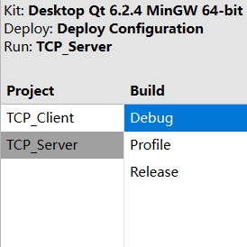
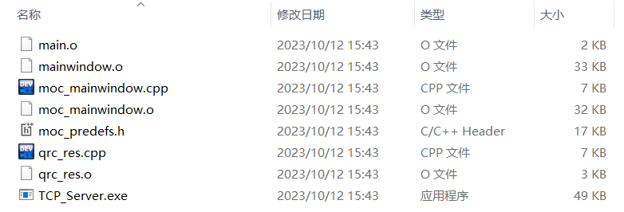
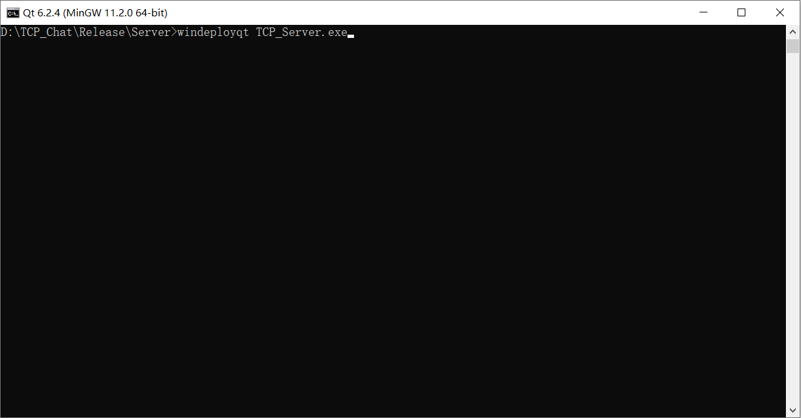

# TCP_Chat
A  project about Chatting with TCP-IP By QT 6.2 

实现一个简单的服务器和客户端的聊天室

- 优化了 `listen()` 函数监听过程

**如何打包发布 QT 程序(Release)**

- 在编译时选择 **Release** 选项 , 进入**Release**目录下 , 将要 `.exe` 文件复制到单独的文件夹中

  

  

  

- 运行 ***Qt 6.2.4(MinGW 11.2.0 64bit)*** , 进入命令行界面

  

- 使用命令切换到 `.exe` 文件夹目录下 , 使用打包命令 `windeployqt .exefile`即可将所需库打包到当前目录下

  

  
